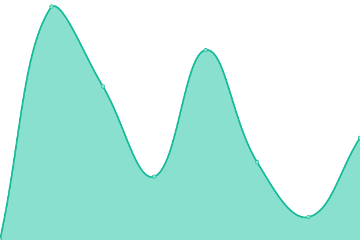
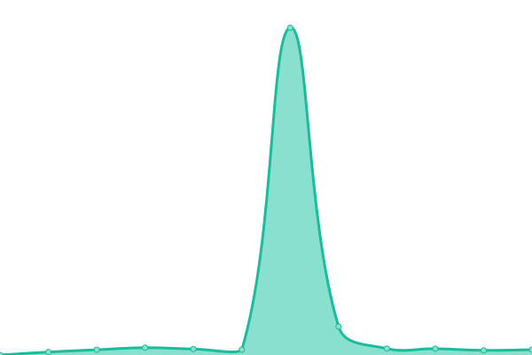
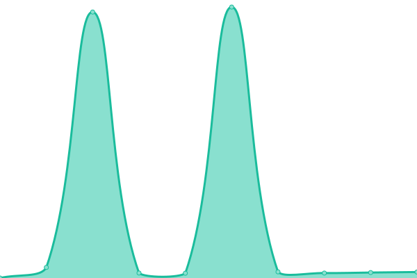
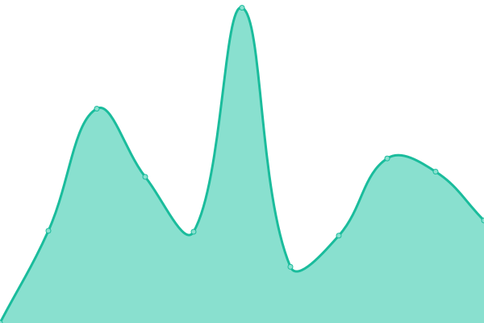
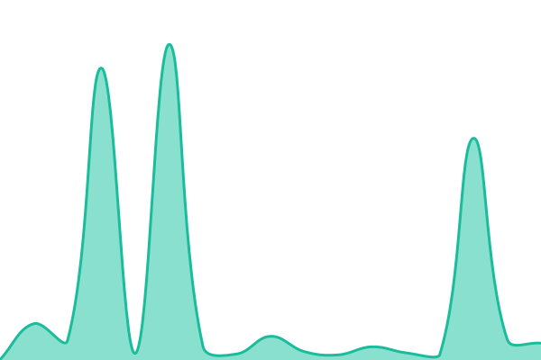
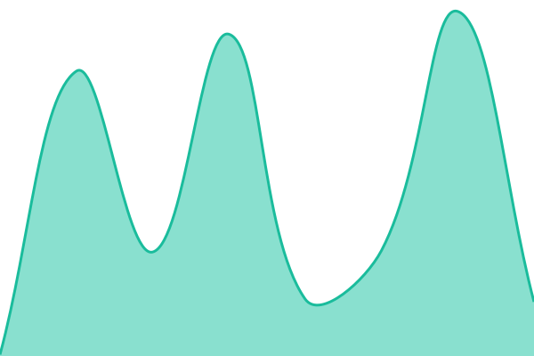
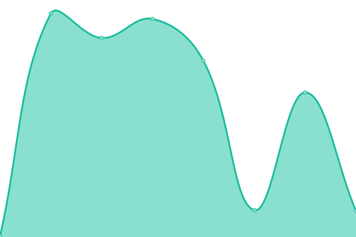

# Service Status Monitor: <!--live status--> **🟧 Partial outage**

This repository contains status monitoring for some services.

<!--start: status pages-->
<!-- This summary is generated by Upptime (https://github.com/upptime/upptime) -->
<!-- Do not edit this manually, your changes will be overwritten -->
<!-- prettier-ignore -->
| URL | Status | History | Response Time | Uptime |
| --- | ------ | ------- | ------------- | ------ |
|  [xtex's Home](https://xtexx.eu.org) | 🟩 Up | [xtex-s-home.yml](https://github.com/xtexx/uptime/commits/HEAD/history/xtex-s-home.yml) | 

 658ms
     
 | 

<a href="https://upptime.xtexx.eu.org/history/xtex-s-home">100.00%</a>
    

|  [xtex's Blog](https://blog.xtexx.eu.org) | 🟩 Up | [xtex-s-blog.yml](https://github.com/xtexx/uptime/commits/HEAD/history/xtex-s-blog.yml) | 

 613ms
     
 | 

<a href="https://upptime.xtexx.eu.org/history/xtex-s-blog">100.00%</a>
    

|  [xtex's Uptime](https://uptime.xtexx.eu.org) | 🟥 Down | [xtex-s-uptime.yml](https://github.com/xtexx/uptime/commits/HEAD/history/xtex-s-uptime.yml) | 

 292ms
     
 | 

<a href="https://upptime.xtexx.eu.org/history/xtex-s-uptime">0.00%</a>
    

|  [xtex's Upptime](https://upptime.xtexx.eu.org) | 🟩 Up | [xtex-s-upptime.yml](https://github.com/xtexx/uptime/commits/HEAD/history/xtex-s-upptime.yml) | 

 377ms
     
 | 

<a href="https://upptime.xtexx.eu.org/history/xtex-s-upptime">100.00%</a>
    

|  [Xensor V Wiki](https://w.xvnet.eu.org) | 🟩 Up | [xensor-v-wiki.yml](https://github.com/xtexx/uptime/commits/HEAD/history/xensor-v-wiki.yml) | 

 866ms
     
 | 

<a href="https://upptime.xtexx.eu.org/history/xensor-v-wiki">100.00%</a>
    

|  [Xens Meta Wiki](https://meta.w.xvnet.eu.org) | 🟩 Up | [xens-meta-wiki.yml](https://github.com/xtexx/uptime/commits/HEAD/history/xens-meta-wiki.yml) | 

 948ms
     
 | 

<a href="https://upptime.xtexx.eu.org/history/xens-meta-wiki">100.00%</a>
    

|  [FLCC Wiki](https://hgdns.ren) | 🟩 Up | [flcc-wiki.yml](https://github.com/xtexx/uptime/commits/HEAD/history/flcc-wiki.yml) | 

 1243ms
     
 | 

<a href="https://upptime.xtexx.eu.org/history/flcc-wiki">100.00%</a>
    

|  [Xensor V Network ntfy](https://ntfy.xvnet.eu.org) | 🟩 Up | [xensor-v-network-ntfy.yml](https://github.com/xtexx/uptime/commits/HEAD/history/xensor-v-network-ntfy.yml) | 

 743ms
     
 | 

<a href="https://upptime.xtexx.eu.org/history/xensor-v-network-ntfy">100.00%</a>
    

|  [Project Archive](https://lakeus.xyz) | 🟥 Down | [project-archive.yml](https://github.com/xtexx/uptime/commits/HEAD/history/project-archive.yml) | 

 79ms
     
 | 

<a href="https://upptime.xtexx.eu.org/history/project-archive">97.36%</a>
    

|  [Wikipedia](https://en.wikipedia.org) | 🟩 Up | [wikipedia.yml](https://github.com/xtexx/uptime/commits/HEAD/history/wikipedia.yml) | 

 144ms
     
 | 

<a href="https://upptime.xtexx.eu.org/history/wikipedia">100.00%</a>
    

|  [Wikitech](https://wikitech.wikimedia.org) | 🟩 Up | [wikitech.yml](https://github.com/xtexx/uptime/commits/HEAD/history/wikitech.yml) | 

 286ms
     
 | 

<a href="https://upptime.xtexx.eu.org/history/wikitech">100.00%</a>
    

<!--end: status pages-->

## 📄 License

- Powered by: [Upptime](https://github.com/upptime/upptime)
- Code: [MIT](./LICENSE) © [Anand Chowdhary](https://anandchowdhary.com), supported by [Pabio](https://pabio.com)
- Data in the `./history` directory: [Open Database License](https://opendatacommons.org/licenses/odbl/1-0/)
